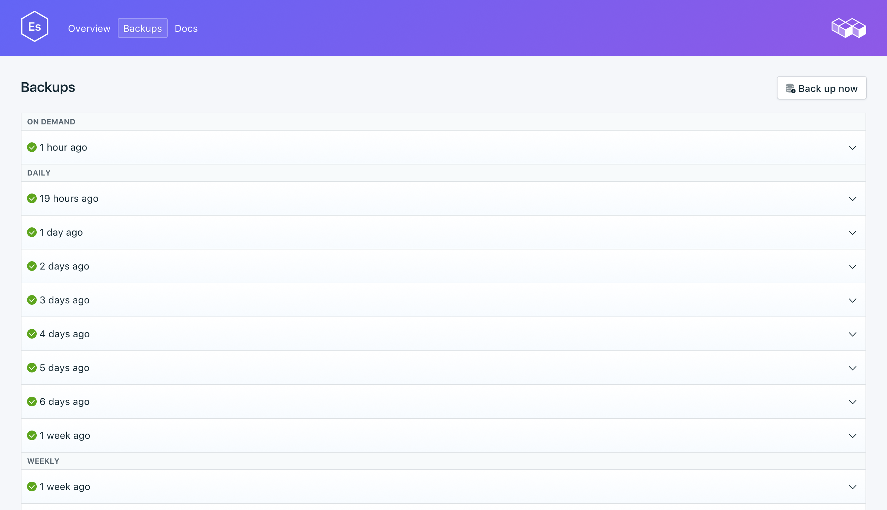
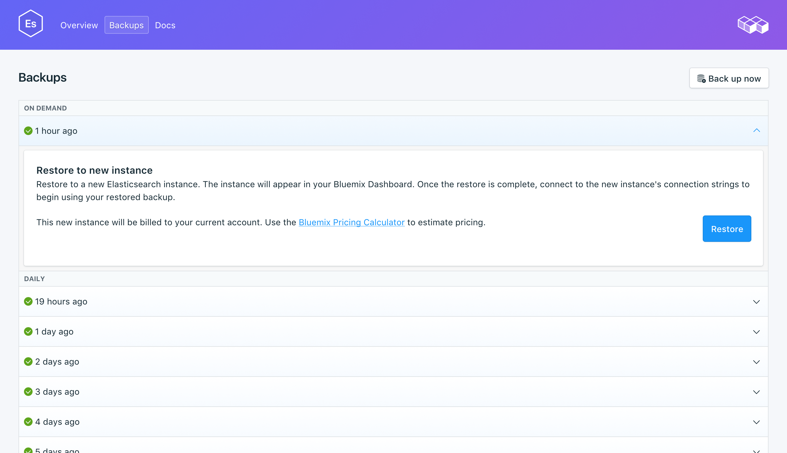

---

copyright:
  years: 2016,2018
lastupdated: "2018-04-19"

keywords: elasticsearch, compose

subcollection: compose-for-elasticsearch

---

{:new_window: target="_blank"}
{:shortdesc: .shortdesc}
{:screen: .screen}
{:codeblock: .codeblock}
{:pre: .pre}

# Managing backups
{: #dashboard-backups}

You can create and restore backups from the _Backups_ tab of the _Manage_ page of your service dashboard. Daily, weekly, monthly, and on-demand backups are available and retained according to the following schedule:

Backup type|Retention schedule
----------|-----------
Daily|Daily backups are retained for 7 days
Weekly|Weekly backups are retained for 4 weeks
Monthly|Monthly backups are retained for 3 months
On-demand|One on-demand backup is retained. The retained backup is always the most recent on-demand backup.
{: caption="Table 1. Backup retention schedule" caption-side="top"}

## Viewing existing backups

Daily backups of your database are automatically scheduled. You can view your existing backups from your service dashboard.

1. Navigate to your service Dashboard.
2. Click **Backups** in the tabs to open the _Backups_ page. A list of available backups is shown:

  

Click the corresponding row to expand the options for any available backup.
   

### Using the API to view existing backups

A list of backups is available at the `GET /2016-07/deployments/:id/backups` endpoint. The Foundation Endpoint, the service instance ID, and the deployment ID are shown on the service _Overview_ page. For example:

``` 
https://composebroker-dashboard-public.mybluemix.net/api/2016-07/instances/$INSTANCE_ID/deployments/$DEPLOYMENT_ID/backups
```  

## Creating a manual backup

To create a manual backup, follow the steps to view existing backups, then click **Back up now**. A message is displayed that a backup is in progress, and a 'pending' backup is added to the list of available backups.

### Using the API to create a backup

Send a POST request to the backups endpoint to initiate a manual backup: `POST /2016-07/deployments/:id/backups`. It returns immediately with the recipe ID and information about the backup as it is running. Before you can use the backup that you need to check the backups endpoint to verify that the backup is complete, and find the `backup_id` value.

```
GET /2016-07/deployments/:id/backups/
```

## Restoring a backup

1. Follow the steps to view existing backups.
2. Click the corresponding row to expand the options for the backup you want to restore.
3. Click the **Restore** button. A message is displayed to say that a restore is in progress. The new service instance appears on your dashboard when provisioning starts, and has the generated name `elasticsearch-restore-[timestamp]`.

When you are restoring from a backup, your data is restored to the most recent minor version available for {{site.data.keyword.composeForElasticsearch}}. You can override this setting by restoring through the {{site.data.keyword.cloud_notm}} CLI and sending in the version you want to restore to.

**Note:** You can restore to only a version that is available for provisioning.

### Restoring via CLI

Use the following steps to restore a backup from a running Elasticsearch service to a new Elasticsearch service by using the {{site.data.keyword.cloud_notm}} CLI. 
1. If you need to, [download and install the CLI](/docs/cli?topic=cloud-cli-overview). 
2. Find the backup that you would like to restore from on the _Backups_ page on your service and copy the backup ID.  
  **Or**  
  Use the `GET /2016-07/deployments/:id/backups` to find a backup and its ID through the Compose API. The Foundation Endpoint and the service instance ID are both shown in the service's _Overview_. For example: 
  ``` 
  https://composebroker-dashboard-public.mybluemix.net/api/2016-07/instances/$INSTANCE_ID/deployments/$DEPLOYMENT_ID/backups
  ```  
  The response includes a list of all available backups for that service instance. Pick the backup that you want to restore from and copy its ID.

3. Log in with the appropriate account and credentials. `ibmcloud login` (or `ibmcloud login -help` to see all the login options).

4. Switch to your Organization and Space `ibmcloud target -o "$YOUR_ORG" -s "YOUR_SPACE"`

5. Use the `service create` command to provision a new service, and provide the source service and the specific backup that you are restoring in a JSON object.

  ``` 
  ibmcloud service create SERVICE PLAN SERVICE_INSTANCE_NAME -c '{"source_service_instance_id": "$SERVICE_INSTANCE_ID", "backup_id": "$BACKUP_ID" }'
  ```

  <dl>
  <dt>_SERVICE_</dt>
  <dd>Use `compose-for-elasticsearch`.</dd>
  <dt>_PLAN_</dt>
  <dd>Use either Standard or Enterprise depending on your environment.</dd>
  <dt>_SERVICE\_INSTANCE\_NAME_</dt>
  <dd>The name of your new service.</dd>
  <dt>_source\_service\_instance\_id_</dt>
  <dd>The service instance ID of the source of the backup. You can obtain the value by running `ibmcloud cf service DISPLAY_NAME --guid`, where _DISPLAY\_NAME_ is the name of the service the backup is from. </dd>
  </dl>

  You can use the optional JSON parameter "db_version" to specify which version of Elasticsearch to restore to. This parameter is also used to [upgrade to a major version of Elasticsearch](docs/services/ComposeForElasticsearch?topic=compose-for-elasticsearch-upgrading).
  
  Enterprise users also need to specify which cluster to deploy to in the JSON object with the `"cluster_id": "$CLUSTER_ID"` parameter.

