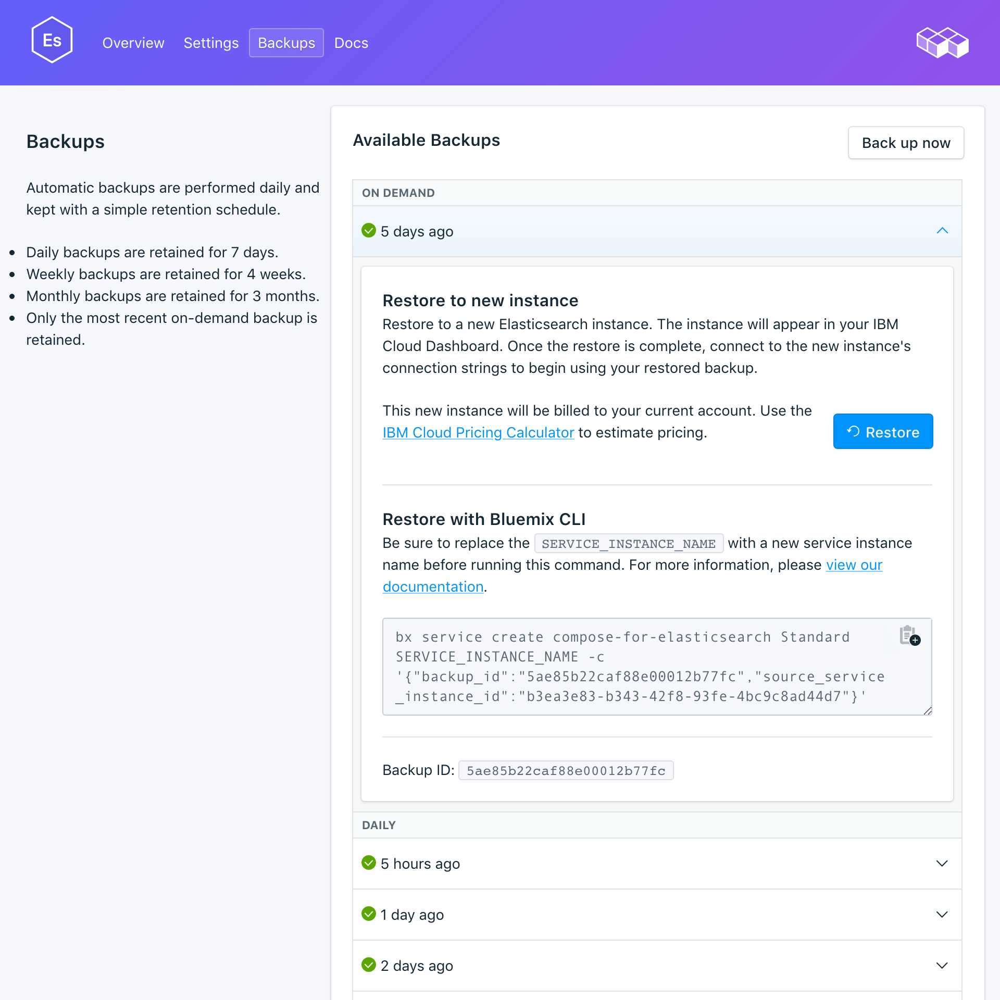

---

copyright:
  years: 2017
lastupdated: "2017-12-05"
---

{:new_window: target="_blank"}
{:shortdesc: .shortdesc}
{:screen: .screen}
{:codeblock: .codeblock}
{:pre: .pre}

# Managing Backups
{: #backups}

You can create and download backups from the _Backups_ tab of the _Manage_ page of your service dashboard. Daily, weekly, monthly, and on-demand backups are available. They are retained according to the following schedule:

Backup type|Retention schedule
----------|-----------
Daily|Daily backups are retained for 7 days
Weekly|Weekly backups are retained for 4 weeks
Monthly|Monthly backups are retained for 3 months
On-demand|One on-demand backup is retained. The retained backup is always the most recent on-demand backup.
{: caption="Table 1. Backup retention schedule" caption-side="top"}

Backup schedules and retention policies are fixed. If you need to keep more backups than the retention schedule allows, you should download backups and retain archives according to your business requirements.

## Viewing existing backups

Daily backups of your database are automatically scheduled. To view your existing backups:

1. Navigate to your service Dashboard.
2. Click **Backups** in the tabs to open the _Backups_ page. A list of available backups is shown:

  

Click on the corresponding row to expand the options for any available backup.

 

## Creating a manual backup

As well as scheduled backups you can create a backup manually. To create a manual backup, follow the steps to view existing backups, then click **Back up now** above the list of available backups. A message is displayed to let you know that a backup has been initiated, and a 'pending' backup is added to the list of available backups.

## Backup contents

{{site.data.keyword.composeForElasticsearch}} backups are taken with the snapshot utility in the Elasticsearch API. The process is executed on the entire cluster in non-blocking fashion so all indexing and search operations can continue normally while it is running. A point-in-time backup is made at the moment when the snapshot is created.

## Restoring a backup
To restore a backup to a new service instance, follow the steps to view existing backups, then click in the corresponding row to expand the options for the backup you want to download. Click on the **Restore** button. A message is displayed to let you know that a restore has been initiated. The new service instance will automatically be named "elasticsearch-restore-[timestamp]", and appears on your dashboard when provisioning starts.
