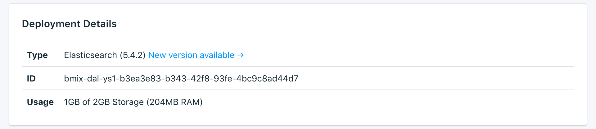

---

Copyright:
  Years: 2017
lastupdated: "2017-09-07"
---

{:new_window: target="_blank"}
{:shortdesc: .shortdesc}
{:screen: .screen}
{:codeblock: .codeblock}
{:pre: .pre}

# Dashboard Overview

You can manage your {{site.data.keyword.composeForElasticsearch_full}} service from the service dashboard.

The _Overview_ page shows you information about your {{site.data.keyword.cloud}} Compose database. The overview includes essential identifying information and current resource usage. You'll also find a section for connection strings that you can use with tools or make use of tools to connect to your database.

## Deployment Details

The _Deployment Details_ panel shows details of your service.

### Type

The type of database that is offered by the service, and the database version that your service uses.

### Name

An internal identifier for the service.

### Usage

The size of your database and the amount of storage provided by your service plan.

## Connection Strings

Connection Strings can be used by some client libraries and contain all the information needed for other libraries to connect. You can find out how to use a Connection String to connect to your service in [Connecting an external application](./connecting-external.html).

You'll find each Connection String for your service in a different tab in the _Connection Strings_ panel.

### HTTPS

A URI-formatted connection string that can be used by some client libraries and contains all the information needed for other libraries to connect. You can find out how to use the Connection String to connect in [Connecting an external application](./connecting-external.html).

### Health

An example call that you can use to find out the health of the Elasticsearch cluster.
