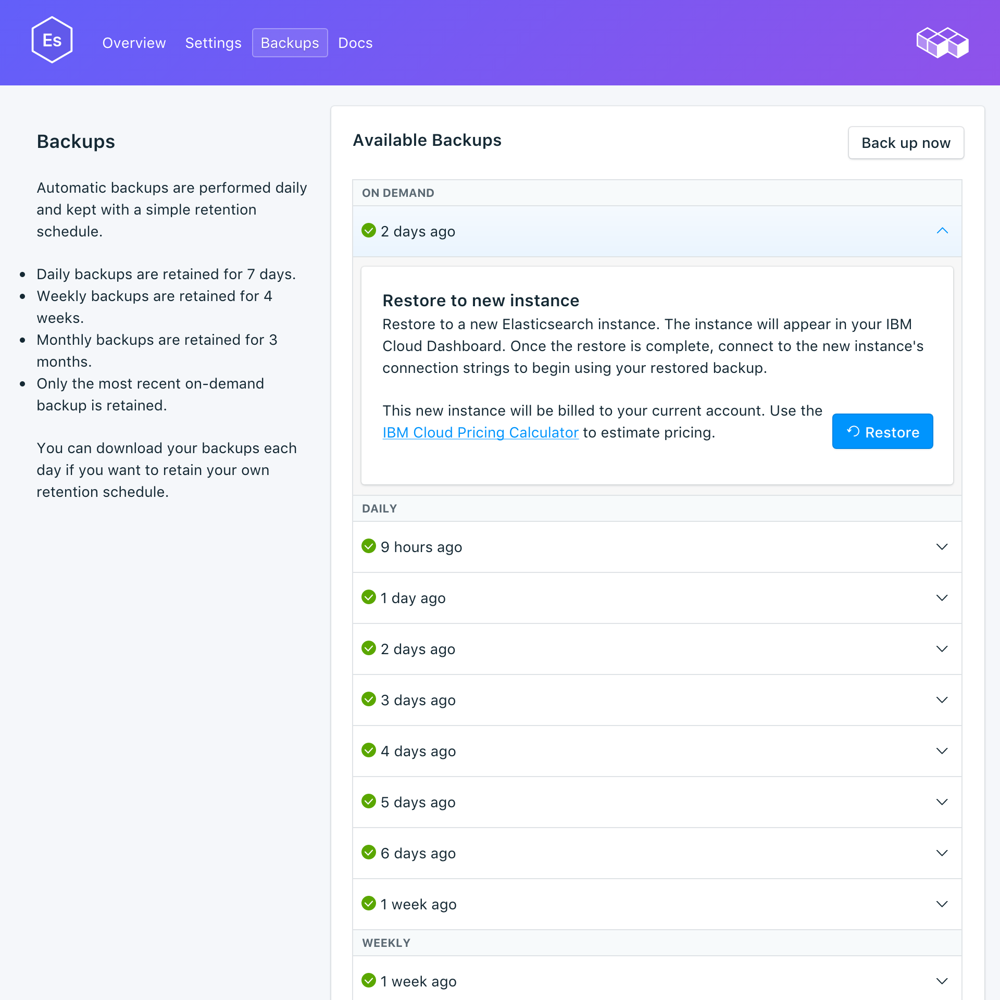

---

copyright:
  years: 2016,2018
lastupdated: "2018-04-19"
---

{:new_window: target="_blank"}
{:shortdesc: .shortdesc}
{:screen: .screen}
{:codeblock: .codeblock}
{:pre: .pre}

# Sicherungen verwalten
{: #backups}

Sie können Sicherungen erstellen und über die Registerkarte _Sicherungen_ der Seite _Verwalten_ Ihres Service-Dashboards wiederherstellen. Dabei sind tägliche, wöchentliche und monatliche Sicherungen sowie Sicherungen nach Bedarf verfügbar. Die Aufbewahrungszeit richtet sich nach folgendem Zeitplan:

Sicherungstyp|Aufbewahrungszeitplan
----------|-----------
Täglich|Tägliche Sicherungen werden 7 Tage aufbewahrt
Wöchentlich|Wöchentliche Sicherungen werden 4 Wochen aufbewahrt
Monatlich|Monatliche Sicherungen werden 3 Monate aufbewahrt
Bei Bedarf|Es wird eine bei Bedarf erstellte Sicherung aufbewahrt. Dabei ist die aufbewahrte Sicherung immer die letzte bei Bedarf erstellte Sicherung.
{: caption="Tabelle 1. Aufbewahrungszeitplan für Sicherungen" caption-side="top"}

## Vorhandene Sicherungen anzeigen

Tägliche Sicherungen Ihrer Datenbank werden automatisch geplant. Sie können Ihre vorhandenen Sicherungen über das Service-Dashboard anzeigen.

1. Navigieren Sie zu Ihrem Service-Dashboard.
2. Klicken Sie auf die Registerkarte **Sicherungen**, um die Seite _Sicherungen_ zu öffnen. Es wird eine Liste der verfügbaren Sicherungen angezeigt:

  

Klicken Sie auf eine Zeile, um die Optionen für die entsprechende verfügbare Sicherung zu erweitern.  

### API verwenden, um vorhandene Backups anzuzeigen

Eine Liste der Backups steht am Endpunkt `GET /2016-07/deployments/:id/backups` zur Verfügung. Die Basisendpunkte mit der Serviceinstanz-ID und der Bereitstellungs-ID werden beide in der _Übersicht_ des Service angezeigt. Beispiel: 
``` 
https://composebroker-dashboard-public.mybluemix.net/api/2016-07/instances/$INSTANCE_ID/deployments/$DEPLOYMENT_ID/backups
```  

## Manuelle Sicherung erstellen

Führen Sie zum Erstellen einer manuellen Sicherung die Schritte zum Anzeigen der vorhandenen Sicherungen aus. Klicken Sie dann über der Liste der vorhandenen Sicherungen auf **Jetzt sichern**. Es wird eine Nachricht mit dem Inhalt angezeigt, dass eine Sicherung gestartet wurde, und zu der Liste der verfügbaren Sicherungen wird eine Sicherung vom Typ 'Anstehend' hinzugefügt.

### API verwenden, um eine Sicherung zu erstellen

Senden Sie eine POST-Anforderung an den Endpunkt der Sicherung, um eine manuelle Sicherung zu initialisieren: `POST /2016-07/deployments/:id/backups`. Daraufhin wird sofort die Anleitungs-ID mit Informationen zur aktiven Sicherung zurückgegeben. Bevor Sie die Sicherung verwenden können, müssen Sie den Endpunkt für Sicherungen überprüfen, um sicherzustellen, dass die Sicherung beendet wurde. Außerdem müssen Sie vor Verwendung der Sicherung den Wert für `backup_id` suchen.

```
GET /2016-07/deployments/:id/backups/
```

## Sicherung wiederherstellen

1. Führen Sie die Schritte zum Anzeigen der vorhandenen Sicherungen aus.
2. Klicken Sie in eine Zeile, um die Optionen für die Sicherung zu erweitern, die wiederhergestellt werden soll.
3. Klicken Sie auf die Schaltfläche **Wiederherstellen**. Es wird eine Nachricht mit dem Inhalt angezeigt, dass eine Wiederherstellung gestartet wurde. Die neue Serviceinstanz wird mit dem generierten Namen `elasticsearch-restore-[zeitmarke]` in Ihrem Dashboard angezeigt, wenn die Bereitstellung beginnt.

Bei der Wiederherstellung auf der Basis einer Sicherungskopie werden die Daten mit der neuesten untergeordneten Version wiederhergestellt, die für {{site.data.keyword.composeForElasticsearch}} verfügbar ist. Sie können diese Einstellung außer Kraft setzen, indem Sie die Wiederherstellung über die {{site.data.keyword.cloud_notm}}-Befehlszeilenschnittstelle durchführen und die Version angeben, die wiederhergestellt werden soll.

**Hinweis:** Eine Wiederherstellung ist nur für eine Version möglich, die zur Bereitstellung verfügbar ist.

### Wiederherstellung über die Befehlszeilenschnittstelle

Führen Sie die folgenden Schritte aus, um eine Sicherung aus einem aktiven Elasticsearch-Service mithilfe der {{site.data.keyword.cloud_notm}}-CLI in einem neuen Elasticsearch-Service wiederherzustellen. 
1. Bei Bedarf können Sie die [CLI herunterladen und installieren](https://console.{DomainName}/docs/cli/index.html#overview). 
2. Suchen Sie auf der Seite _Sicherungen_ in Ihrem Service die Sicherung aus, die Sie wiederherstellen möchten, und kopieren Sie die Sicherungs-ID.  
  **ODER**  
  Verwenden Sie `GET /2016-07/deployments/:id/backups`, um eine Sicherung und die zugehörige ID über die Compose-API zu suchen. Sowohl der Basisendpunkt als auch die Serviceinstanz-ID wird in der _Übersicht_ des Service angezeigt. Beispiel: 
  ``` 
  https://composebroker-dashboard-public.mybluemix.net/api/2016-07/instances/$INSTANCE_ID/deployments/$DEPLOYMENT_ID/backups
  ```  
  Die Antwort enthält eine Liste aller verfügbaren Sicherungen für diese Serviceinstanz. Wählen Sie die Sicherung aus, die Sie für die Wiederherstellung verwenden möchten, und kopieren Sie die zugehörige ID.

3. Melden Sie sich mit dem entsprechenden Konto und den zugehörigen Berechtigungsnachweisen an. Verwenden Sie hierfür den Befehl `ibmcloud login` (oder `ibmcloud login -help`, damit alle Anmeldeoptionen angezeigt werden).

4. Wechseln Sie mit `ibmcloud target -o "$YOUR_ORG" -s "YOUR_SPACE"` zu Ihrer Organisation und Ihrem Bereich.

5. Verwenden Sie den Befehl `service create`, um einen neuen Bereich bereitzustellen und stellen Sie den Quellenservice und die spezifische Sicherung zur Verfügung, die Sie in einem JSON-Objekt wiederherstellen. Beispiel:
``` 
ibmcloud service create SERVICE PLAN SERVICE_INSTANCE_NAME -c '{"source_service_instance_id": "$SERVICE_INSTANCE_ID", "backup_id": "$BACKUP_ID" }'
```
  Für das Feld _SERVICE_ sollte `compose-for-elasticsearch` und für das Feld _PLAN_ sollte abhängig von Ihrer Umgebung entweder 'Standard' oder 'Enterprise' angegeben sein. In _SERVICE\_INSTANCE\_NAME_ geben Sie den Namen für Ihren neuen Service an. _source\_service\_instance\_id_ ist die Serviceinstanz-ID der Quelle der Sicherung. Diese kann durch Ausführen von `ibmcloud cf service DISPLAY_NAME --guid` abgerufen werden, wobei _DISPLAY\_NAME_ der Name des Service ist, von dem die Sicherung stammt. 

  Mit dem optionalen JSON-Parameter "db_version" können Sie die Elasticsearch-Version angeben, die wiederhergestellt werden soll. Dieser Parameter wird auch verwendet, um ein [Upgrade auf eine übergeordnete Version von Elasticsearch](./upgrading.html) durchzuführen.
  
  Enterprise-Benutzer müssen ferner angeben, welcher Cluster in dem JSON-Objekt mit dem Parameter `"cluster_id": "$CLUSTER_ID"` bereitgestellt werden soll.

