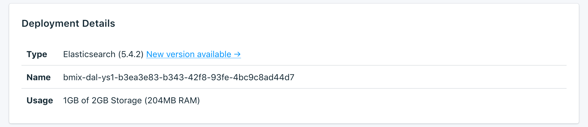

---

Copyright:
  years: 2016,2018
lastupdated: "2018-05-07"
---

{:new_window: target="_blank"}
{:shortdesc: .shortdesc}
{:screen: .screen}
{:codeblock: .codeblock}
{:pre: .pre}

# Übersicht über das Dashboard

Sie können Ihren {{site.data.keyword.composeForElasticsearch_full}}-Service über das Service-Dashboard verwalten.

Auf der Seite _Übersicht_ finden Sie Informationen zu Ihrer {{site.data.keyword.cloud}} Compose-Datenbank. Die Übersicht enthält die zentralen Identifikationsinformationen sowie die aktuelle Ressourcennutzung. Außerdem ist ein Abschnitt für Verbindungszeichenfolgen vorhanden, die Sie für die Verbindungsherstellung mit Ihrer Datenbank verwenden können.

## Bereitstellungsdetails

Die Anzeige _Bereitstellungsdetails_ enthält Details zu Ihrem Service.

### Typ

Der Datenbanktyp, der vom Service angeboten wird, und die Datenbankversion, die Ihr Service verwendet. Wenn eine neuere Datenbankversion verfügbar ist, wird eine Benachrichtigung zusammen mit einem Link zum Abschnitt [Upgradeversion](/docs/services/ComposeForElasticsearch/dashboard-settings.html#upgrade-version) Ihres Service-Dashboards angezeigt.

### ID

Eine interne ID für den Service.

### Nutzung

Die Größe Ihrer Datenbank und der von Ihrem Serviceplan bereitgestellte Speicherplatz.

## Verbindungszeichenfolgen

Verbindungszeichenfolgen können von bestimmten Clientbibliotheken verwendet werden. Sie enthalten alle Informationen, die andere Bibliotheken zum Herstellen einer Verbindung benötigen. Informationen dazu, wie sich mithilfe einer Verbindungszeichenfolge eine Verbindung zu Ihrem Service herstellen lässt, finden Sie im Abschnitt [Externe Anwendung verbinden](/docs/services/ComposeForElasticsearch/connecting-external.html).

Die einzelnen Verbindungszeichenfolgen für Ihren Service befinden sich jeweils auf einer eigenen Registerkarte der Anzeige _Verbindungszeichenfolgen_.

### HTTPS

Eine per URI formatierte Verbindungszeichenfolge, die von bestimmten Clientbibliotheken verwendet werden kann. Sie enthält alle Informationen, die andere Bibliotheken zum Herstellen einer Verbindung benötigen. Informationen dazu, wie sich mithilfe der Verbindungszeichenfolge eine Verbindung herstellen lässt, finden Sie im Abschnitt [Externe Anwendung verbinden](/docs/services/ComposeForElasticsearch/connecting-external.html).

### Status

Ein Beispielaufruf, mit dem Sie den Status des Elasticsearch-Clusters herausfinden können.

## Instanzverwaltungs-API

Sie können Ihren {{site.data.keyword.composeForElasticsearch}}-Service über die {{site.data.keyword.cloud_notm}} Compose-API verwalten.

### Basisendpunkt

Der Basisendpunkt setzt sich aus der Region, in der sich der Service befindet, und der Serviceinstanz-ID zusammen. Er steht am Anfang eines jeden Endpunkts.

### Bereitstellungs-ID

Die Bereitstellungs-ID wird für die meisten Aufrufe benötigt und gibt eine bestimmte Bereitstellungsinstanz an.

### Referenz

Zusätzliche Dokumentation und Referenz zur Verwendung der {{site.data.keyword.cloud_notm}} Compose-API für alle {{site.data.keyword.cloud_notm}} Compose-Services finden Sie in [Die {{site.data.keyword.cloud_notm}} Compose-API](https://www.compose.com/articles/the-ibm-cloud-compose-api/).
