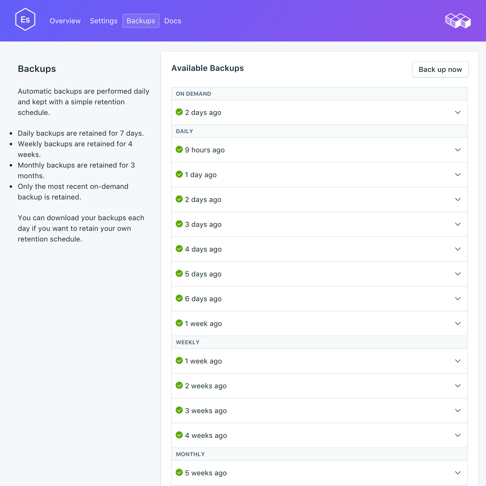

---

copyright:
  years: 2016,2018
lastupdated: "2018-04-19"
---

{:new_window: target="_blank"}
{:shortdesc: .shortdesc}
{:screen: .screen}
{:codeblock: .codeblock}
{:pre: .pre}

# Gestión de copias de seguridad
{: #backups}

Puede crear y restaurar copias de seguridad desde el separador _Copias de seguridad_ de la página _Gestionar_ del panel de control del servicio. Las copias de seguridad diarias, semanales, mensuales y bajo demanda están disponibles. Se retienen según la siguiente planificación:

Tipo de copia de seguridad|Planificación de retención
----------|-----------
Diario|Las copias de seguridad diarias se retienen durante 7 días
Semanal|Las copias de seguridad semanales se retienen durante 4 semanas
Mensual|Las copias de seguridad mensuales se retienen durante 3 meses
Bajo demanda|Se retiene una copia de seguridad bajo demanda. La copia de seguridad retenida es siempre la copia de seguridad bajo demanda más reciente.
{: caption="Tabla 1. Planificación de retención de copia de seguridad" caption-side="top"}

## Visualización de las copias de seguridad existentes

Se planifican automáticamente copias de seguridad diarias de la base de datos. Puede ver las copias de seguridad existentes desde el panel de control del servicio.

1. Vaya al panel de control del servicio.
2. Pulse **Copias de seguridad** en los separadores para abrir la página _Copias de seguridad_. Aparecerá una lista de las copias de seguridad disponibles:

  

Pulse la fila correspondiente para ampliar las opciones para cualquier copia de seguridad disponible. 

### Utilización de la API para ver las copias de seguridad existentes

Hay una lista de copias de seguridad disponible en el punto final `GET /2016-07/deployments/:id/backups`. El punto final de la fundación con el ID de la instancia de servicio y el ID de despliegue se muestran en la _Visión general_ del servicio. Por ejemplo: 
``` 
https://composebroker-dashboard-public.mybluemix.net/api/2016-07/instances/$INSTANCE_ID/deployments/$DEPLOYMENT_ID/backups
```  

## Creación de una copia de seguridad manual

Para crear una copia de seguridad manual, siga los pasos para ver las copias de seguridad existentes y luego pulse **Copia de seguridad ahora** sobre la lista de copias de seguridad disponibles. Se mostrará un mensaje que le indicará que la copia de seguridad se ha iniciado y se añade una copia de seguridad 'pendiente' a la lista de copias de seguridad disponibles.

### Utilización de la API para crear una copia de seguridad

Envíe una solicitud POST al punto final de las copias de seguridad para iniciar una copia de seguridad manual: `POST /2016-07/deployments/:id/backups`. Se devuelve inmediatamente con el ID de receta e información sobre la copia de seguridad mientras está en ejecución. Antes de utilizar la copia de seguridad, debe comprobar el punto final de las copias de seguridad para verificar que la copia de seguridad ha finalizado, y busque el valor `backup_id` antes de utilizarlo.

```
GET /2016-07/deployments/:id/backups/
```

## Restauración de una copia de seguridad

1. Siga los pasos para ver las copias de seguridad existentes.
2. Pulse la fila correspondiente para ampliar las opciones de la copia de seguridad que desea restaurar.
3. Pulse el botón **Restaurar**. Se mostrará un mensaje que le indicará que se ha iniciado una restauración. La nueva instancia de servicio aparece en el panel de control cuando se inicia el suministro, y tiene el nombre generado `elasticsearch-restore-[timestamp]`.

Al restaurar a partir de una copia de seguridad, los datos se restaurarán a la versión menor más reciente disponible para {{site.data.keyword.composeForElasticsearch}}. Puede sobrescribir este valor restaurando a través de la CLI de {{site.data.keyword.cloud_notm}} y enviando en la versión a la que desea restaurar.

**Nota:** Solo puede restaurar a una versión disponible para el suministro.

### Restauración mediante la CLI

Utilice los pasos siguientes para restaurar una copia de seguridad de un servicio Elasticsearch en ejecución a un servicio Elasticsearch nuevo mediante la CLI de {{site.data.keyword.cloud_notm}}. 
1. Si es necesario, [descargue e instale la CLI](https://console.{DomainName}/docs/cli/index.html#overview). 
2. Busque la copia de seguridad que desea restaurar en la página _Copias de seguridad_ del servicio y copie el ID de copia de seguridad.  
  **O**  
  Utilice `GET /2016-07/deployments/:id/backups` para buscar una copia de seguridad y su ID mediante la API de Compose. El punto final de la fundación y el ID de la instancia de servicio se muestran en la _Visión general_ del servicio. Por ejemplo: 
  ``` 
  https://composebroker-dashboard-public.mybluemix.net/api/2016-07/instances/$INSTANCE_ID/deployments/$DEPLOYMENT_ID/backups
  ```  
  La respuesta incluye una lista de todas las copias de seguridad disponibles para dicha instancia de servicio. Seleccione la copia de seguridad desde la que desea restaurar y copie su ID.

3. Inicie sesión con la cuenta y las credenciales adecuadas. `ibmcloud login` (o `ibmcloud login -help` para ver todas las opciones de inicio).

4. Vaya a su organización y espacio `ibmcloud target -o "$YOUR_ORG" -s "YOUR_SPACE"`

5. Utilice el mandato `service create` para suministrar un nuevo servicio y proporcione el servicio de origen y la copia de seguridad específica que va a restaurar en un objeto JSON. Por ejemplo:
``` 
ibmcloud service create SERVICE PLAN SERVICE_INSTANCE_NAME -c '{"source_service_instance_id": "$SERVICE_INSTANCE_ID", "backup_id": "$BACKUP_ID" }'
```
  El campo _SERVICE_ debe ser `compose-for-elasticsearch`, y el campo _PLAN_ debe ser Standard o Enterprise, según el entorno. _SERVICE\_INSTANCE\_NAME_ es donde se pondrá el nombre del nuevo servicio. _source\_service\_instance\_id_ es el ID de instancia de servicio del origen de la copia de seguridad; puede obtenerse ejecutando `ibmcloud cf service DISPLAY_NAME --guid`, donde _DISPLAY\_NAME_ es el nombre del servicio del que es la copia de seguridad. 

  Hay un parámetro de JSON opcional "db_version" si necesita especificar a qué versión de Elasticsearch se restaurará. Este parámetro también se utiliza para [actualizar a una versión principal de Elasticsearch](./upgrading.html).
  
  Los usuarios empresariales también deben especificar en qué clúster se debe realizar el despliegue en el objeto JSON con el parámetro `"cluster_id": "$CLUSTER_ID"`.

