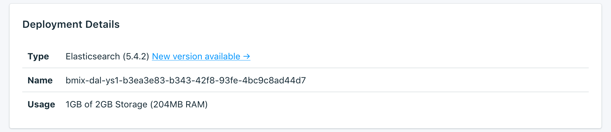

---

Copyright:
  Years: 2017
lastupdated: "2017-09-07"
---

{:new_window: target="_blank"}
{:shortdesc: .shortdesc}
{:screen: .screen}
{:codeblock: .codeblock}
{:pre: .pre}

# Visión general del panel de control

Puede gestionar el servicio {{site.data.keyword.composeForElasticsearch_full}} desde el panel de control del servicio.

La página _Visión general_ muestra información sobre la base de datos de {{site.data.keyword.cloud}} Compose. La visión general incluye información de identificación esencial y el uso actual de recursos. También encontrará una sección correspondiente a las series de conexión que puede utilizar con las herramientas o las herramientas que puede usar para conectarse a la base de datos.

## Detalles de despliegue

El panel _Detalles de despliegue_ muestra detalles del servicio.

### Tipo

El tipo de base de datos que ofrece el servicio y la versión de la base de datos que utiliza el servicio.

### Nombre

Un identificador interno para el servicio.

### Uso

El tamaño de la base de datos y la cantidad de almacenamiento que proporciona su plan de servicio.

## Series de conexión

Algunas bibliotecas de cliente pueden utilizar series de conexión, que contienen toda la información necesaria para que se conecten otras bibliotecas. Encontrará información sobre cómo utilizar una serie de conexión para conectar al servicio en el apartado [Conexión de una aplicación externa](./connecting-external.html).

Encontrará cada serie de conexión para el servicio en un separador diferente en el panel _Series de conexión_.

### HTTPS

Algunas bibliotecas de cliente pueden utilizar una serie de conexión con formato URI, que contiene toda la información necesaria para que se conecten otras bibliotecas. Encontrará información sobre cómo utilizar la serie de conexión para conectarse en el apartado [Conexión de una aplicación externa](./connecting-external.html).

### Estado

Una llamada de ejemplo que puede utilizar para averiguar el estado del clúster Elasticsearch.
