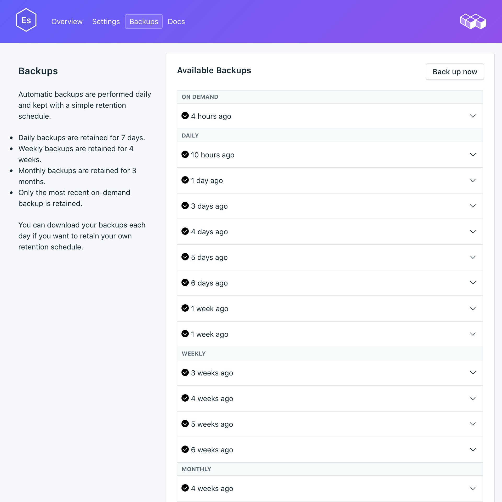
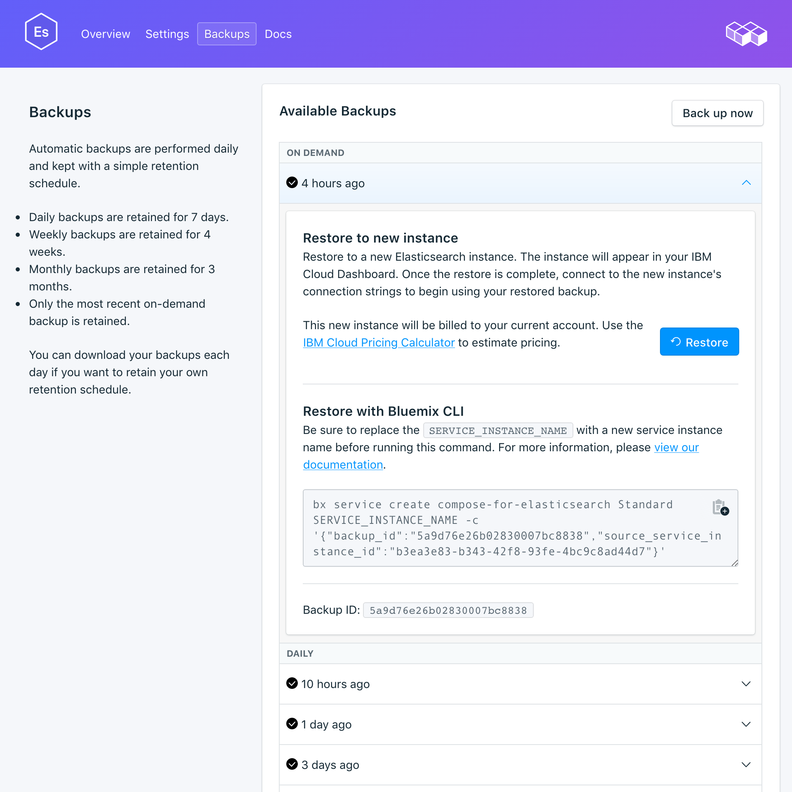

---

copyright:
  years: 2017
lastupdated: "2017-07-13"
---

{:new_window: target="_blank"}
{:shortdesc: .shortdesc}
{:screen: .screen}
{:codeblock: .codeblock}
{:pre: .pre}

# 백업 관리
{: #backups}

서비스 대시보드의 *백업* 페이지에서 백업을 작성하고 다운로드할 수 있습니다. 스케줄된 백업과 수동 백업이 모두 사용 가능합니다.

## 기존 백업 보기

데이터베이스의 일간 백업이 자동으로 스케줄됩니다. 기존 백업을 보려면 다음을 수행하십시오.

1. 서비스 대시보드로 이동하십시오.
2. 탭에서 **백업**을 클릭하여 _백업_ 페이지를 여십시오. 사용 가능한 백업 목록이 표시됩니다.

  

해당 행을 클릭하여 사용 가능한 백업에 대한 옵션을 펼치십시오.

 

## 수동 백업 작성

스케줄된 백업은 물론 수동으로 백업을 작성할 수도 있습니다. 수동 백업을 작성하려면 단계에 따라 기존 백업을 확인한 후 사용 가능한 백업 목록 위에 있는 **지금 백업**을 클릭하십시오. 백업이 시작되었음을 알리는 메시지가 표시되고 '보류 중인' 백업이 사용 가능한 백업 목록에 추가됩니다. 

## 백업 컨텐츠

{{site.data.keyword.composeForElasticsearch}} 백업은 Elasticsearch API에서 스냅샷 유틸리티를 사용하여 작성됩니다. 이 프로세스는 비블로킹 방식으로 전체 클러스터에 대해 실행되므로 프로세스가 실행되는 동안 모든 인덱스 작성 및 검색 오퍼레이션을 정상적으로 계속할 수 있습니다. 스냅샷이 작성된 순간에 특정 시점 백업이 작성됩니다.

## 백업 복원
백업을 새 서비스 인스턴스에 복원하려면 단계에 따라 기존 백업을 확인한 후 해당 행을 클릭하여 다운로드할 백업에 대한 옵션을 펼치십시오. **복원** 단추를 클릭하십시오. 복원이 시작되었음을 알리는 메시지가 표시됩니다. 새 서비스 인스턴스가 자동으로 "elasticsearch-restore-[timestamp]"로 이름 지정되고 프로비저닝이 시작될 때 대시보드에 표시됩니다.
