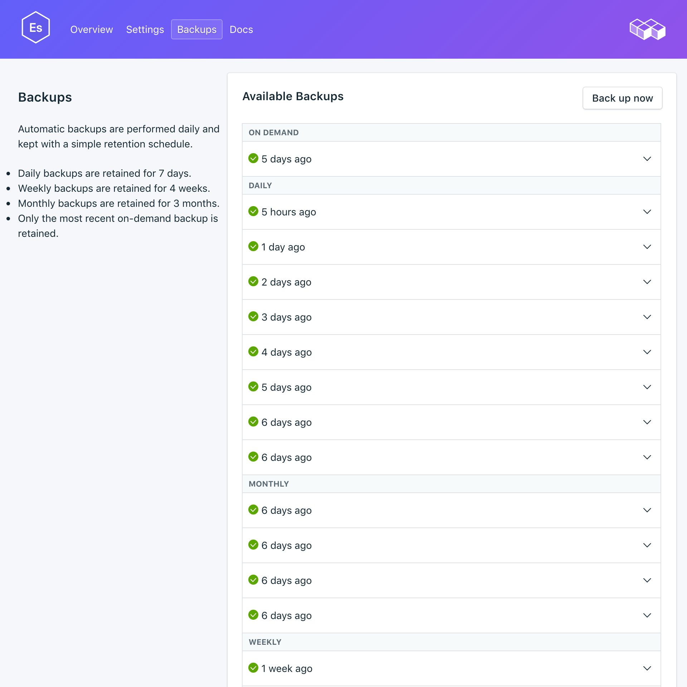

---

copyright:
  year: 2017
lastupdated: "13-07-2017"
---

{:new_window: target="_blank"}
{:shortdesc: .shortdesc}
{:screen: .screen}
{:codeblock: .codeblock}
{:pre: .pre}

# Gerenciando backups
{: #backups}

É possível criar e fazer download de backups na página *Backups* de seu painel de serviço. Ambos os backups, planejado e manual, estão disponíveis.

## Visualizando backups existentes

Os backups diários de seu banco de dados são planejados automaticamente. Para visualizar seus backups existentes:

1. Navegue para seu Painel de serviço.
2. Clique em **Backups** nas guias para abrir a página _Backups_. Uma lista de backups disponíveis é mostrada:

  

Clique na linha correspondente para expandir as opções para qualquer backup disponível.

 

## Criando um backup manual

Além de backups planejados, é possível criar um backup manualmente. Para criar um backup manual, siga as etapas para visualizar os backups existentes, em seguida, clique em **Fazer backup agora** acima da lista de backups disponíveis. Uma mensagem é exibida para permitir que você saiba que um backup foi iniciado e um backup 'pendente' é incluído na lista de backups disponíveis.

## Conteúdos de backup

Os backups do {{site.data.keyword.composeForElasticsearch}} são tomados com o utilitário de captura instantânea na API Elasticsearch. O processo é executado no cluster inteiro em moda sem bloqueio, portanto todas as operações de indexação e procura podem continuar normalmente enquanto ele está em execução. Um backup de momento é feito no momento em que a captura instantânea é criada.

## Restaurando um backup
Para restaurar um backup para uma nova instância de serviço, siga as etapas para visualizar os backups existentes, em seguida, clique na linha correspondente para expandir as opções para o backup que você deseja fazer download. Clique no botão **Restaurar**. Uma mensagem é exibida para permitir que você saiba que uma restauração foi iniciada. A nova instância de serviço será nomeada automaticamente "elasticsearch-restore-[timestamp]" e aparecerá em seu painel quando o fornecimento iniciar.
