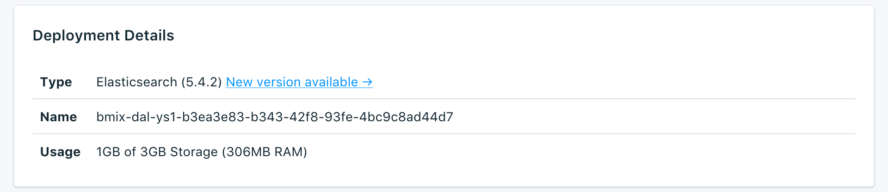

---

Copyright:
  years: 2016,2018
lastupdated: "2018-05-07"
---

{:new_window: target="_blank"}
{:shortdesc: .shortdesc}
{:screen: .screen}
{:codeblock: .codeblock}
{:pre: .pre}

# Visão geral do painel

É possível gerenciar seu serviço {{site.data.keyword.composeForElasticsearch_full}} do painel de serviço.

A página _Visão geral_ mostra informações sobre seu banco de dados do Compose do {{site.data.keyword.cloud}}. A visão geral inclui informações essenciais de identificação e o uso do recurso atual. Também é possível localizar uma seção para as sequências de conexões que podem ser usadas para se conectar ao banco de dados.

## Detalhes da implementação

O painel _Detalhes da implementação_ mostra detalhes de seu serviço.

### Tipo

O tipo de banco de dados que é oferecido pelo serviço e a versão do banco de dados que seu serviço usa. Se uma versão de banco de dados mais recente estiver disponível, uma notificação será exibida, junto a um link para a seção [Fazer upgrade da versão](/docs/services/ComposeForElasticsearch/dashboard-settings.html#upgrade-version) de seu painel de serviço.

### ID

Um identificador interno para o serviço.

### Uso

O tamanho de seu banco de dados e a quantia de armazenamento fornecido por seu plano de serviço.

## Sequências de conexões

As Sequências de conexões podem ser usadas por algumas bibliotecas do cliente. Elas contêm todas as informações que são necessárias para que outras bibliotecas se conectem. É possível descobrir como usar uma Sequência de conexões para conectar-se a seu serviço em [Conectando um aplicativo externo](/docs/services/ComposeForElasticsearch/connecting-external.html).

É possível localizar cada Sequência de conexões para seu serviço em uma guia diferente no painel _Sequências de conexões_.

### HTTPS

Uma sequência de conexões formatada por URI que pode ser usada por algumas bibliotecas do cliente. Ela contém todas as informações necessárias para que outras bibliotecas se conectem. É possível descobrir como usar a Sequência de conexões para conectar-se em [Conectando um aplicativo externo](/docs/services/ComposeForElasticsearch/connecting-external.html).

### Funcionamento

Uma chamada de exemplo que é possível usar para descobrir o funcionamento do cluster do Elasticsearch.

## API de administração de instância

É possível gerenciar o serviço {{site.data.keyword.composeForElasticsearch}} por meio da API do {{site.data.keyword.cloud_notm}} Compose.

### Terminal de base

O terminal base é composto pela região na qual o serviço reside e pelo ID da instância de serviço. Ele está no início de cada terminal.

### ID de implementação

O ID de implementação é necessário para a maioria das chamadas e identifica a instância de implementação específica.

### Referência

Para obter mais documentação e referência para usar a API Compose do {{site.data.keyword.cloud_notm}}, ao longo de todos os serviços Compose do {{site.data.keyword.cloud_notm}}, leia [A API Compose do {{site.data.keyword.cloud_notm}}](https://www.compose.com/articles/the-ibm-cloud-compose-api/).
