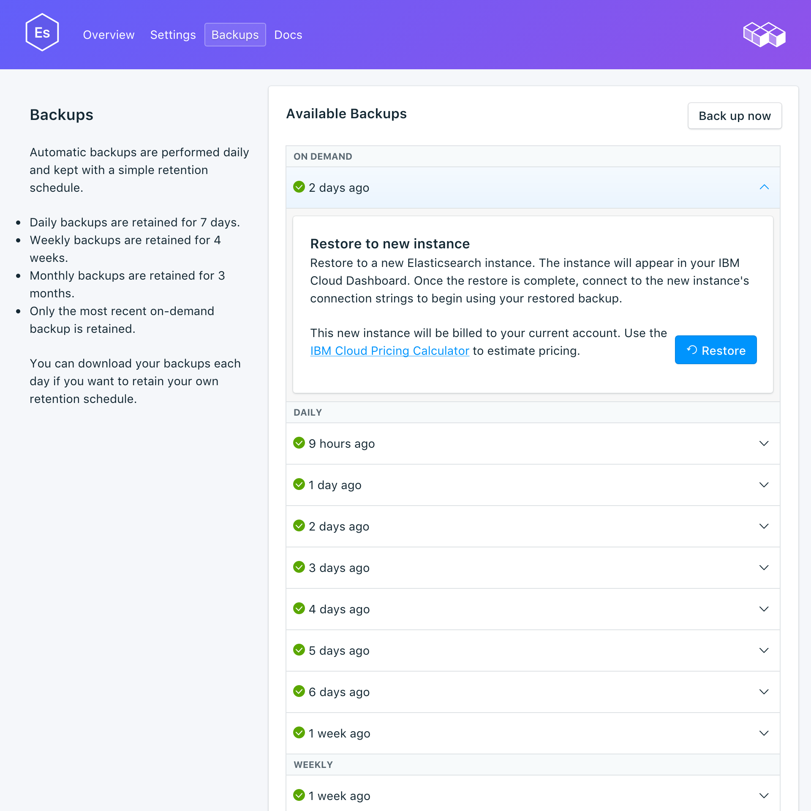

---

copyright:
  years: 2016,2018
lastupdated: "2018-04-19"
---

{:new_window: target="_blank"}
{:shortdesc: .shortdesc}
{:screen: .screen}
{:codeblock: .codeblock}
{:pre: .pre}

# 管理備份
{: #backups}

您可以從服務儀表板之_管理_ 頁面的_備份_ 標籤中，建立及還原備份。有每日、每週、每月及隨需應變備份可供使用。系統會根據下列排程保留它們：

備份類型|保留排程
----------|-----------
每日|每日備份保留 7 日
每週|每週備份保留 4 週
每月|每月備份保留 3 個月
隨需應變|保留一份隨需應變備份。保留的備份一律是最新的隨需應變備份。
{: caption="表 1. 備份保留排程" caption-side="top"}

## 檢視現有備份

資料庫的每日備份是自動排定的。您可以從服務儀表板檢視現有的備份。

1. 導覽至服務儀表板。
2. 按一下標籤中的**備份**，以開啟_備份_ 頁面。即會顯示可用備份的清單：

  

按一下對應列來展開任何可用備份的選項。
   

### 使用 API 檢視現有備份

備份的清單位於 `GET /2016-07/deployments/:id/backups` 端點上。具有服務實例 ID 及部署 ID 的「基礎端點」會顯示在服務的_概觀_ 中。例如： 
``` 
https://composebroker-dashboard-public.mybluemix.net/api/2016-07/instances/$INSTANCE_ID/deployments/$DEPLOYMENT_ID/backups
```  

## 建立手動備份

若要建立手動備份，請遵循步驟來檢視現有備份，然後在可用備份的清單上方按一下**立即備份**。即會顯示一則訊息，讓您知道已開始備份，且已將「擱置」備份新增至可用備份的清單。

### 使用 API 建立備份

請將 POST 要求傳送至 backups 端點，以起始手動備份：`POST /2016-07/deployments/:id/backups`。它會立即傳回執行中備份的秘訣 ID 及相關資訊。使用備份之前，您需要先檢查備份端點以驗證備份是否已完成，並在使用之前尋找 `backup_id` 值。

```
GET /2016-07/deployments/:id/backups/
```

## 還原備份

1. 遵循步驟以檢視現有備份。
2. 按一下對應列來展開要還原之備份的選項。
3. 按一下**還原**按鈕。即會顯示一則訊息，讓您知道已開始還原。新的服務實例會在佈建開始時出現在儀表板上，並且具有產生的名稱 `elasticsearch-restore-[timestamp]`。

從備份還原時，您的資料將還原至最新的可用 {{site.data.keyword.composeForElasticsearch}} 次要版本。您可以透過 {{site.data.keyword.cloud_notm}} CLI 還原並以想要還原到的版本傳送來置換此設定。

**附註：**您只能還原至可供佈建的版本。

### 透過 CLI 還原

請使用下列步驟，以使用 {{site.data.keyword.cloud_notm}} CLI 將備份從執行中 Elasticsearch 服務還原至新的 Elasticsearch 服務。 
1. 如果您需要，請[下載並安裝 CLI](https://console.{DomainName}/docs/cli/index.html#overview)。 
2. 在服務的_備份_ 頁面上，尋找您要從中還原的備份，然後複製備份 ID。  
  **或**  
  透過 Compose API 使用 `GET /2016-07/deployments/:id/backups` 尋找備份及其 ID。「基礎端點」及服務實例 ID 都會顯示在服務的_概觀_ 中。例如： 
  ``` 
  https://composebroker-dashboard-public.mybluemix.net/api/2016-07/instances/$INSTANCE_ID/deployments/$DEPLOYMENT_ID/backups
  ```  
  回應包括該服務實例之所有可用備份的清單。請挑選您要從中還原的備份，並複製其 ID。

3. 使用適當的帳戶及認證登入。`ibmcloud login`（或 `ibmcloud login -help` 以查看所有登入選項）。

4. 切換至「組織」及「空間」：`ibmcloud target -o "$YOUR_ORG" -s "YOUR_SPACE"`

5. 使用 `service create` 指令來佈建新的服務，並在 JSON 物件中提供您要還原的來源服務及特定備份。例如：
``` 
ibmcloud service create SERVICE PLAN SERVICE_INSTANCE_NAME -c '{"source_service_instance_id": "$SERVICE_INSTANCE_ID", "backup_id": "$BACKUP_ID" }'
```
  _SERVICE_ 欄位應該是 `compose-for-elasticsearch`，而 _PLAN_ 欄位應該是 Standard（標準）或 Enterpris（企業），視您的環境而定。_SERVICE\_INSTANCE\_NAME_ 是您將放置新服務名稱的位置。_source\_service\_instance\_id_ 是備份來源的服務實例 ID；其取得方式是執行 `ibmcloud cf service DISPLAY_NAME --guid`，其中 _DISPLAY\_NAME_ 是備份來源的服務名稱。 

  如果您需要指定要還原至哪個 Elasticsearch 版本，有一個選用性的 JSON 參數 "db_version" 可用。這個參數也用來[升級至 Elasticsearch 的主要版本](./upgrading.html)。
  
  企業使用者也需要使用 `"cluster_id": "$CLUSTER_ID"` 參數，在 JSON 物件中指定要部署到哪個叢集。

