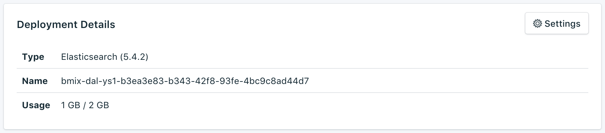

---

Copyright:
  years: 2016,2018
lastupdated: "2017-12-05"
---

{:new_window: target="_blank"}
{:shortdesc: .shortdesc}
{:screen: .screen}
{:codeblock: .codeblock}
{:pre: .pre}

# 儀表板概觀

您可以從服務儀表板管理您的 {{site.data.keyword.composeForElasticsearch_full}} 服務。

_概觀_ 頁面顯示 {{site.data.keyword.cloud}} Compose 資料庫的相關資訊。概觀包括基本識別資訊及現行資源使用。您也會找到一個區段，以尋找可與工具搭配使用的連線字串，或利用工具來連接至您的資料庫。

## 部署詳細資料

_部署詳細資料_ 畫面顯示服務的詳細資料。

### 類型

服務所提供的資料庫類型，以及服務使用的資料庫版本。如果有更新的資料庫版本可用，則會顯示通知，並附有一個鏈結，可讓您前往服務儀表板的[升級版本](/docs/services/ComposeForElasticsearch/dashboard-settings.html#upgrade-version)區段。

### 名稱

服務的內部 ID。

### 用量

服務方案所提供的資料庫大小及儲存空間數量。

## 連線字串

「連線字串」可以由某些用戶端程式庫使用，且包含其他程式庫進行連接時所需的一切資訊。您可以在[連接外部應用程式](/docs/services/ComposeForElasticsearch/connecting-external.html)中，瞭解如何使用「連線字串」來連接至您的服務。

您將在_連線字串_ 畫面的另一個標籤中，找到服務的每一個「連線字串」。

### HTTPS

URI 格式的連線字串，可由某些用戶端程式庫使用，且包含其他程式庫進行連接時所需的一切資訊。您可以在[連接外部應用程式](/docs/services/ComposeForElasticsearch/connecting-external.html)中，瞭解如何使用「連線字串」來連接。

### 性能

可用來找出 Elasticsearch 叢集性能的範例呼叫。

## 實例管理 API

您可以透過 {{site.data.keyword.cloud_notm}} Compose API 管理 {{site.data.keyword.composeForElasticsearch}} 服務。

### 基礎端點

基礎端點是由服務所在地區及服務實例 ID 所組成。它將位於每個端點的開頭處。

### 部署 ID

大部分呼叫都需要部署 ID，其可識別特定的部署實例。

### 參考資訊

如需如何在所有 {{site.data.keyword.cloud_notm}} Compose 服務中使用 {{site.data.keyword.cloud_notm}} Compose API 的其他文件及參照，請閱讀 [{{site.data.keyword.cloud_notm}} Compose API](https://www.compose.com/articles/the-ibm-cloud-compose-api/)。
